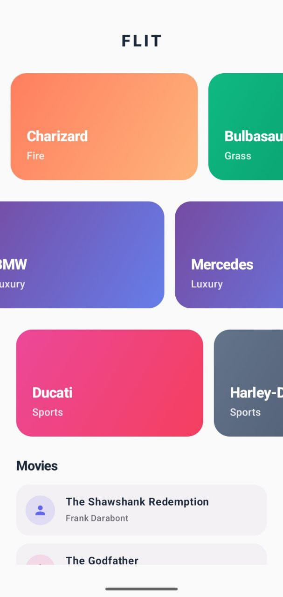
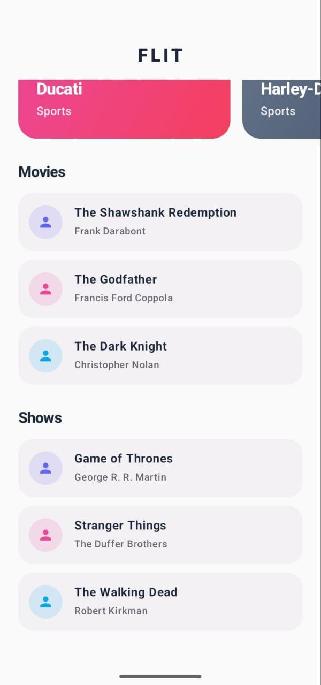

This project demonstrates a dynamic, backend-driven dashboard screen built using Jetpack Compose and MVVM architecture.
Widgets are rendered purely based on metadata received from a backend source, without hardcoded UI positions.

📌 Problem Statement

Build a dashboard screen that:

Displays a vertical list of widgets

Renders widgets only from backend metadata

Supports multiple instances of the same widget type

Ensures widget state is isolated using instanceId

Uses Jetpack Compose and MVVM

Avoids business logic inside composables.

📌Architecture Overview

UI (Compose)

   ↓
 
ViewModel

   ↓
 
Domain (Repository Interface, Models)'

   ↓
 
Data (Repository Implementation, Fake APIs)

📌 Key Design Principles

UI is stateless and renders data only

ViewModels own all logic and state

Repositories abstract data sources

Each widget instance is independent

🔄 Data Flow

DashboardViewModel fetches widget metadata from the repository

DashboardScreen renders widgets dynamically using this metadata

For each widget:

Banner widgets receive static data and render immediately

List widgets create their own ViewModel using instanceId

Each List widget:

Fetches data independently

Manages its own loading / success / error state

📦 Widget Metadata Format

{

       "type": "banner" | "list",
  
       "instanceId": "string"
  
}

Example response:

[

      { "type": "banner", "instanceId": "pokemon" },
  
      { "type": "banner", "instanceId": "cars" },
  
      { "type": "banner", "instanceId": "bikes" },
   
      { "type": "list", "instanceId": "movies" },
  
      { "type": "list", "instanceId": "shows" }
  
]

The UI renders widgets in the same order as the metadata.

🧱 Widgets Implemented

1️⃣ Banner Widget

Stateless

Fully driven by data

Displays one or more banners

Uses LazyRow for horizontal scrolling

BannerWidget(banners: List<BannerConfig>)

2️⃣ List Widget

Stateful

Fetches data using a fake API

Handles:

Loading

Success

Error

Each instance owns its state via instanceId

ListWidget(instanceId: String)

🔐 State Isolation Using instanceId

Each List widget:

Receives a unique instanceId

Creates its own ViewModel

Fetches data independently

ListWidgetViewModel(instanceId)

This guarantees:

Same widget type can appear multiple times

No shared state between widget instances

One widget failure does not affect others

🧠 Key Takeaway

The UI is fully driven by backend metadata, widget state is isolated using instanceId, and the architecture cleanly separates concerns using MVVM and Jetpack Compose best practices.

  
  

